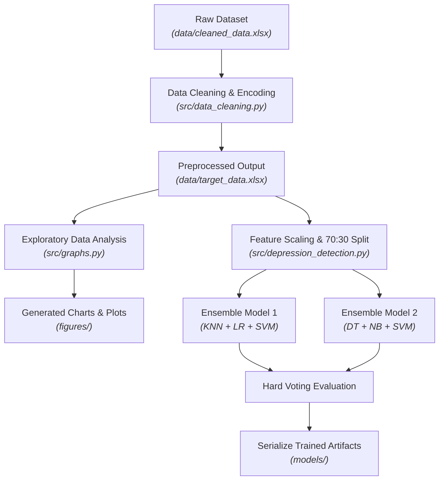

# A Machine Learning Implementation for Mental Health Care Application: Smart Watch for Depression Detection

[](https://ieeexplore.ieee.org/abstract/document/9377199)
[](#publication--links)
[](src/)

## Authors
* **Piyush Kumar** - Department of Computer Science & Engineering, Amity University, Noida, India
* **Rishi Chauhan** - Department of Computer Science & Engineering, Amity University, Noida, India
* **Dr. Thompson Stephan** - Faculty of Engineering and Technology, M.S. Ramaiah University of Applied Sciences, Bangalore, India
* **Dr. Achyut Shankar** - Department of Computer Science & Engineering, Amity University, Noida, India
* **Dr. Sanjeev Thakur** - Department of Computer Science & Engineering, Amity University, Noida, India

---

## Publication & Links
* **Conference:** 2021 11th International Conference on Cloud Computing, Data Science & Engineering (Confluence)[cite: 3]
* **IEEE Xplore Paper:** [View Article on IEEE Xplore](https://ieeexplore.ieee.org/abstract/document/9377199)

---

## Abstract
Mental illness presents a global healthcare challenge, with depression affecting over 264 million individuals worldwide. Early identification remains difficult due to limited access to diagnostic resources, particularly in low- and middle-income regions. This research presents a machine learning pipeline integrated with smartwatch sensor paradigms to evaluate mental health conditions from empirical survey data. Using the Kaggle Unemployment and Mental Illness dataset (334 entries across 31 features), we clean irrelevant noise, perform categorical label encoding, and construct two hard-voting ensemble models. Our primary ensemble combining K-Nearest Neighbors (KNN), Logistic Regression (LR), and Support Vector Machines (SVM) achieves an average detection accuracy of **89.603%**.

---

## Key Features
* **Automated Data Cleaning & Feature Selection:** Filters low-variance and irrelevant social indicators (e.g., hospitalization days, region, housing subsidies) to optimize model generalization.
* **Exploratory Data Visualization:** Automated generation of count distributions and proportion pie charts across key mental health symptoms (anxiety, depression, mood swings) and employment states.
* **Ensemble Machine Learning Architecture:** Multi-algorithm hard-voting classifiers leveraging linear, distance-based, tree-based, and probabilistic algorithms.
* **Model Serialization:** Automated export of trained `StandardScaler` transformations and voting ensemble model binaries for real-time inference on edge wearables.

---

## Architecture Overview

The system ingests sensor and survey attributes, cleans noise, visualizes exploratory distributions, and trains voting ensembles to predict depression status.


## Dependencies

### Prerequisites
* `Python 3.8+`

### Required Python packages 
Install all dependencies using pip:
`pip install pandas numpy scikit-learn matplotlib seaborn joblib openpyxl`

## Project Directory Setup

```
.
├── data/
│   ├── cleaned_data.xlsx         # Raw input survey dataset
│   └── target_data.xlsx          # Processed feature-selected dataset
├── figures/
│   ├── anxiety_distribution.png  # Anxiety count distribution plot
│   ├── depression_distribution.png # Depression count distribution plot
│   ├── employment_pie_chart.png  # Employment vs unemployment pie chart
│   └── symptoms_pie_chart.png    # Symptom breakdown pie chart
├── models/
│   ├── ensemble_model_1.joblib   # Trained KNN + LR + SVM Voting Classifier
│   ├── ensemble_model_2.joblib   # Trained DT + NB + SVM Voting Classifier
│   └── scaler.joblib             # Fitted StandardScaler object
└── src/
    ├── data_cleaning.py          # Script 1: Cleans data & encodes features
    ├── graphs.py                 # Script 2: Generates EDA figures
    └── depression_detection.py   # Script 3: Trains ensembles & saves models
```

## Installation & Setup
1. Installation & Setup:
    [git clone](https://github.com/pikum06/smartwatch-depression-detection.git)
   `cd smartwatch-depression-detection`

2. Execute the Execution Sequence:
   Run the scripts strictly in the following order:
   - Step 1: Clean Data & Preprocess Features
      `python src/data_cleaning.py`
   - Step 2: Generate Exploratory Visualizations
      `python src/graphs.py`
   - Step 3: Train Ensembles & Export Artifacts
      `python src/depression_detection.py`

## Experimental Results
The ensemble classifiers were evaluated across iterative random train-test splits (70:30 ratio):

| **Model** | **Sub-Algorithms Included** | **Average Accuracy** |
| --- | --- | --- |
| Ensemble Model 1 | K-Nearest Neighbors (KNN), Logistic Regression (LR), Support Vector Machine (SVM) | 89.603% | 
| Ensemble Model 2 | Decision Tree (DT), Gaussian Naïve Bayes (NB), Support Vector Machine (SVM) | 87.539% |

## Citations

If you use this codebase, dataset pipeline, or research findings in your work, please cite our IEEE paper:
IEEE Style:

```P. Kumar, R. Chauhan, T. Stephan, A. Shankar and S. Thakur, "A Machine Learning Implementation for Mental Health Care Application: Smart Watch for Depression Detection," 2021 11th International Conference on Cloud Computing, Data Science & Engineering (Confluence), Noida, India, 2021, pp. 718-723, doi: 10.1109/Confluence51648.2021.9377199.```

BibTeX:
```
@inproceedings{kumar2021smartwatch,
  author={Kumar, Piyush and Chauhan, Rishi and Stephan, Thompson and Shankar, Achyut and Thakur, Sanjeev},
  booktitle={2021 11th International Conference on Cloud Computing, Data Science \& Engineering (Confluence)}, 
  title={A Machine Learning Implementation for Mental Health Care Application: Smart Watch for Depression Detection}, 
  year={2021},
  pages={718-723},
  doi={10.1109/Confluence51648.2021.9377199}
}
```

